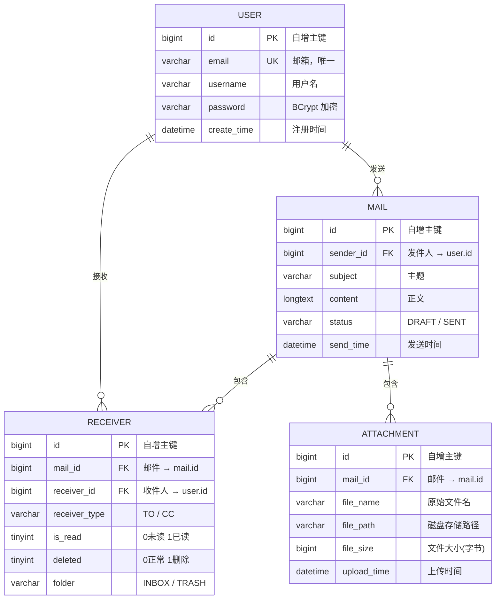

# osSchoolWork
操作系统课程作业项目，包含后端（Spring Boot + MyBatis Plus + JWT）与前端（Vue 3 + Vite + Element Plus）。

---

## 1. 环境要求

- JDK 17/21
- Maven 3.9+
- Node.js 20+
- MySQL 8.0+

---

## 2. 数据库初始化

1. 创建数据库：`os_school`
2. 执行建表脚本：`backend/sql/schema.sql`
3. 按需修改 `backend/src/main/resources/application.yml` 中的数据库账号、密码与 JWT 配置。
4. （可选）导入测试数据：`mysql -u root -p os_school < backend/sql/test-data.sql`

> 详细字段对照表、常用排查 SQL 见 [`backend/sql/README.md`](backend/sql/README.md)

### E-R 图



> User ↔ Mail 为多对多，通过 receiver 表实现。

---

## 3. 启动后端

在项目根目录执行：

```bash
cd backend
mvn spring-boot:run
```

默认端口：`8081`。

---

## 4. 启动前端

在项目根目录执行：

```bash
cd frontend
npm install
npm run dev
```

默认访问：`http://localhost:5173`

前端通过 Vite 代理访问后端 `/api`；如需更换后端地址，可在前端配置 `VITE_API_BASE_URL`。

